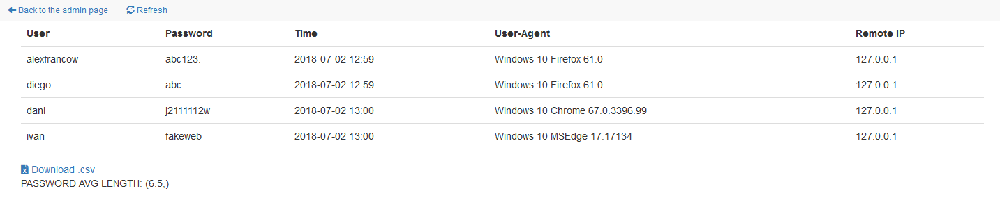
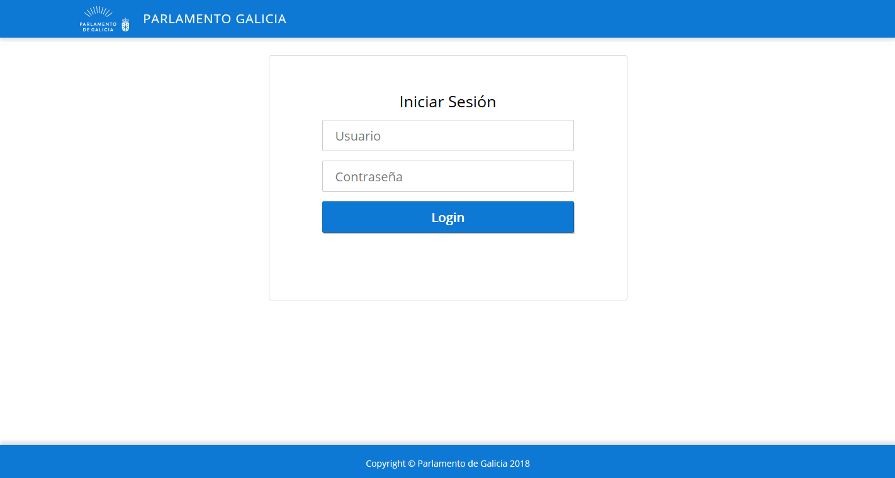

### Installation
##### Dependencies
```sh
$ sudo apt install python3-venv
```
##### Run on venv [recommended]
```sh
$ . venv/bin/activate
(venv)$ python -V
Python 3.6.5
$ python3 app.py
[?] Install/Update dependencies? Y/n: n
[?] Please enter the name of your wireless interface (for the AP): wlan1
[?] Please enter the name of your internet connected interface: wlan0
[?] Please enter the SSID for the AP: Telefonia2
[?] Please enter the BSSID for the AP: 00:1F:45:7F:DD:1B
[?] Please enter the channel for the AP: 7
[?] Airbase-ng or hostapd? (A/h): A
```

### Usage

Administrative URL: ```http://10.0.0.1/admin``` ~ ```http://10.0.0.1/users```



### Fake Web

URL: ```http://10.0.0.1```



### IPTables

```bash
root@kali:~/github/Fake-CP# iptables -nvL -t nat
Chain PREROUTING (policy ACCEPT 12 packets, 1148 bytes)
 pkts bytes target     prot opt in     out     source               destination
    0     0 DNAT       tcp  --  at0    *       0.0.0.0/0            0.0.0.0/0            tcp dpt:80 to:10.0.0.1:80

Chain INPUT (policy ACCEPT 8 packets, 940 bytes)
 pkts bytes target     prot opt in     out     source               destination

Chain OUTPUT (policy ACCEPT 6 packets, 378 bytes)
 pkts bytes target     prot opt in     out     source               destination

Chain POSTROUTING (policy ACCEPT 0 packets, 0 bytes)
 pkts bytes target     prot opt in     out     source               destination
    6   378 MASQUERADE  all  --  *      wlan0   0.0.0.0/0            0.0.0.0/0

```
#### Network Interfaces

```bash
root@kali:~/github/Fake-CP# iwconfig
lo        no wireless extensions.

wlan1     IEEE 802.11  Mode:Monitor  Frequency:2.442 GHz  Tx-Power=18 dBm
          Retry short limit:7   RTS thr:off   Fragment thr:off
          Power Management:off

eth0      no wireless extensions.

wlan0     IEEE 802.11  ESSID:"Empresa2"
          Mode:Managed  Frequency:2.442 GHz  Access Point: 00:1F:45:7F:DD:18
          Bit Rate=65 Mb/s   Tx-Power=31 dBm
          Retry short limit:7   RTS thr:off   Fragment thr:off
          Encryption key:off
          Power Management:on
          Link Quality=35/70  Signal level=-75 dBm
          Rx invalid nwid:0  Rx invalid crypt:0  Rx invalid frag:0
          Tx excessive retries:192  Invalid misc:0   Missed beacon:0

at0       no wireless extensions.

```

#### Network Address

```bash
root@kali:~/github/Fake-CP# ifconfig
at0: flags=4163<UP,BROADCAST,RUNNING,MULTICAST>  mtu 1500
        inet 10.0.0.1  netmask 255.255.255.0  broadcast 10.0.0.255
        inet6 fe80::2c0:caff:fe96:619c  prefixlen 64  scopeid 0x20<link>
        ether 00:c0:ca:96:61:9c  txqueuelen 1000  (Ethernet)
        RX packets 0  bytes 0 (0.0 B)
        RX errors 0  dropped 0  overruns 0  frame 0
        TX packets 12  bytes 928 (928.0 B)
        TX errors 0  dropped 0 overruns 0  carrier 0  collisions 0

eth0: flags=4163<UP,BROADCAST,RUNNING,MULTICAST>  mtu 1500
        inet 192.168.1.111  netmask 255.255.255.0  broadcast 192.168.1.255
        inet6 fe80::ba27:ebff:fe83:b099  prefixlen 64  scopeid 0x20<link>
        ether b8:27:eb:83:b0:99  txqueuelen 1000  (Ethernet)
        RX packets 24373  bytes 1436088 (1.3 MiB)
        RX errors 0  dropped 0  overruns 0  frame 0
        TX packets 19677  bytes 2102162 (2.0 MiB)
        TX errors 0  dropped 0 overruns 0  carrier 0  collisions 0

lo: flags=73<UP,LOOPBACK,RUNNING>  mtu 65536
        inet 127.0.0.1  netmask 255.0.0.0
        inet6 ::1  prefixlen 128  scopeid 0x10<host>
        loop  txqueuelen 1  (Local Loopback)
        RX packets 0  bytes 0 (0.0 B)
        RX errors 0  dropped 0  overruns 0  frame 0
        TX packets 0  bytes 0 (0.0 B)
        TX errors 0  dropped 0 overruns 0  carrier 0  collisions 0

wlan0: flags=4163<UP,BROADCAST,RUNNING,MULTICAST>  mtu 1500
        inet 192.168.4.139  netmask 255.255.255.0  broadcast 192.168.4.255
        inet6 fe80::ba27:ebff:fed6:e5cc  prefixlen 64  scopeid 0x20<link>
        ether b8:27:eb:d6:e5:cc  txqueuelen 1000  (Ethernet)
        RX packets 28891  bytes 11393389 (10.8 MiB)
        RX errors 0  dropped 0  overruns 0  frame 0
        TX packets 27256  bytes 13641554 (13.0 MiB)
        TX errors 0  dropped 0 overruns 0  carrier 0  collisions 0

wlan1: flags=867<UP,BROADCAST,NOTRAILERS,RUNNING,PROMISC,ALLMULTI>  mtu 1800
        unspec 00-C0-CA-96-61-9C-30-30-00-00-00-00-00-00-00-00  txqueuelen 1000  (UNSPEC)
        RX packets 2351233  bytes 0 (0.0 B)
        RX errors 0  dropped 1347173  overruns 0  frame 0
        TX packets 421036  bytes 27649687 (26.3 MiB)
        TX errors 0  dropped 0 overruns 0  carrier 0  collisions 0
```

## How it works?

When a device is connected to the AP, it send a request like: ```"GET /generate_204 HTTP/1.1"````:

```bash
	dnsmasq-dhcp: DHCPREQUEST(at0) 10.0.0.64 30:07:4d:07:6f:6e 
	dnsmasq-dhcp: DHCPACK(at0) 10.0.0.64 30:07:4d:07:6f:6e Galaxy-S8
	10.0.0.64 - - [19/Jul/2018 07:02:22] "GET /generate_204 HTTP/1.1" 404 -
	10.0.0.64 - - [19/Jul/2018 07:03:22] "GET /gen_204 HTTP/1.1" 404 - 
```
iPhone send a request like: ```"GET /hotspot-detect.html HTTP/1.1"```:

```bash
	dnsmasq-dhcp: DHCPREQUEST(at0) 10.0.0.13 1c:5c:f2:65:9d:1b
	dnsmasq-dhcp: DHCPACK(at0) 10.0.0.13 1c:5c:f2:65:9d:1b iPhonedeAlberto
	10.0.0.13 - - [24/Jul/2018 08:00:52] "GET /hotspot-detect.html HTTP/1.0" 404 -
```

Android uses a Network Portal detection using the URL http://clients3.google.com/generate_204. This will return a 204 HTTP response without content when requesting it from the actual Google servers. Captive Portals/Network Portals will return something else (usually a splash page) and keep the requested page URL somewhere in their database. The Android device notices it and shows a notification that this wireless network needs authentication. Pressing this notification will open a browser with the splash page (just by requesting the http://clients3.google.com/generate_204 again). The user can now use some kind of form (e.g. a button) to enter the network. Usually, you will get automatically forwarded by the Network Portal/Captive Portal to the URL you've requested in the first place.

- If we send a 404 code, Android will notify that this AP does not have Internet access.
- If we send a 204 code, Android will thinks we have Internet access.
- IF we send a 302 redirect with the URL of the captive portal, Android will notify that it is a captive portal.

iPhone works similarly, but uses a Network Portal detection using the URL http://captive.apple.com/hotspot-detect.html

We can implenet all those codes with Python Flask in this way:

```python
	@app.route('/generate_204')
	@app.route('/gen_204')
	def android():
		return redirect("http://10.0.0.1/", code=302)
		
	@app.route('/hotspot-detect.html')
	@app.route('/bag')
	def iPhone():
		return redirect("http://10.0.0.1/", code=302)
		
```

Now we need to tell our DNS to point those addresses to at0 (Fake-AP interface).

```bash
	10.0.0.1 connectivitycheck.android.com
	10.0.0.1 connectivitycheck.gstatic.com
	10.0.0.1 clients1.google.com
	10.0.0.1 clients3.google.com
	10.0.0.1 clients.l.google.com
	10.0.0.1 captive.apple.com #For iPhone
	10.0.0.1 1.1.1.1 #For Android 4.4.2
```

## PoC:

[Android - POC](https://youtu.be/F_CLqMGdkFU "Android - POC")

[iPhone - POC](https://youtu.be/3G0qOMTO-fE "iPhone -POC")
