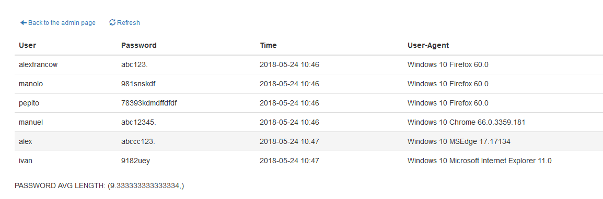

### Installation
#### Virtual Environment [recommended]
```shell
$ . venv/bin/activate
$ python3 run.py
```
#### Base OS
```shell
$ pip install -r requirements.txt
$ python3 run.py
```

### Usage

Admin URL: ```http://127.0.0.1:5000/admin```


